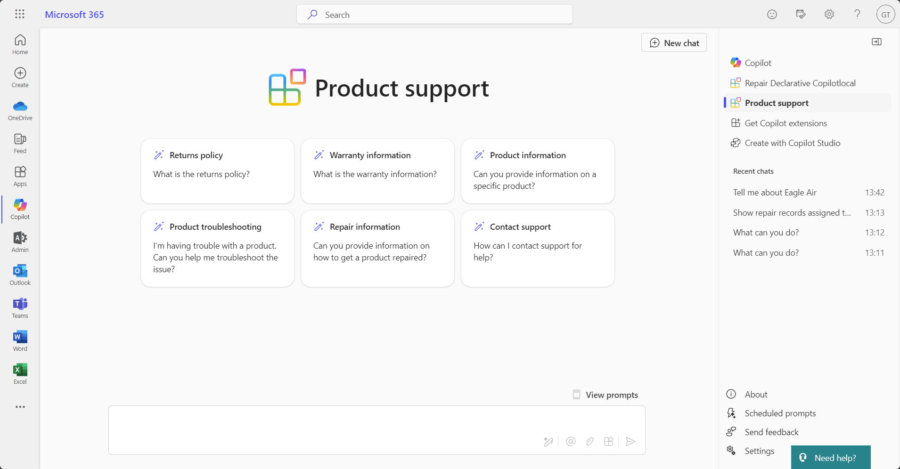
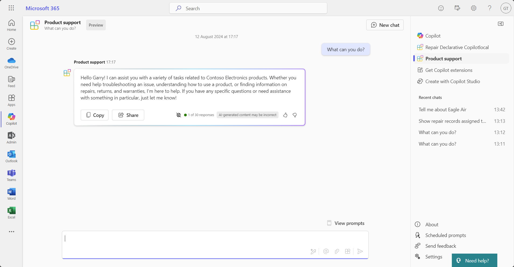
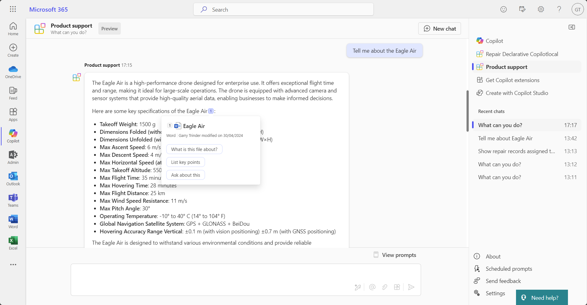
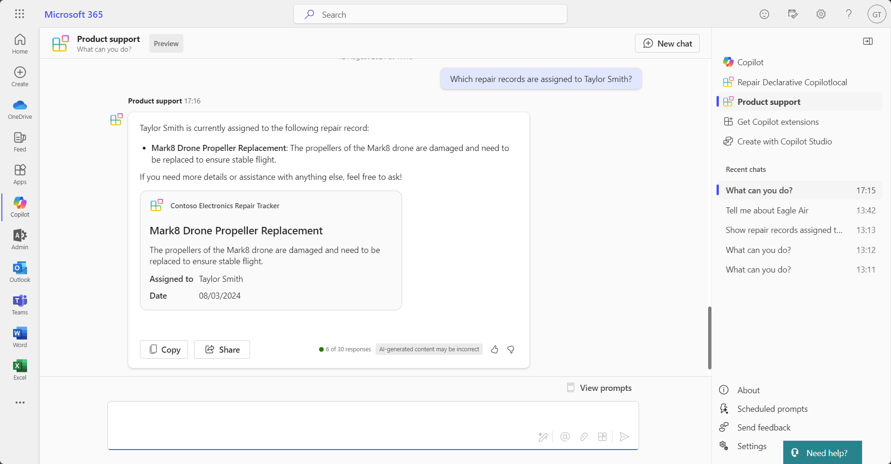

# Product support Declarative copilot

> [!NOTE]
> This sample is work in progress and uses experimental features in Teams Toolkit and functionality in Copilot for Microsoft 365 that is in private preview. The sample may not work as expected and is subject to change.

This sample demonstrates how to use Teams Toolkit for Visual Studio Code to create a Declarative copilot for Copilot for Microsoft 365. The declarative copilot provides a tailored experience for users to get help with their questions and issues related to Contoso Electronics products.

## Features

### Custom conversation starters

### Custom instructions

### Knowledge from SharePoint Online

### API plugin with Adaptive Card response

## Prerequisites

- [Node.js](https://nodejs.org/).
- [Visual Studio Code](https://code.visualstudio.com/) preview with.`TEAMSFX_DECLARATIVE_COPILOT=true` environment variable set.
- [Teams Toolkit CLI](https://www.npmjs.com/package/@microsoft/teamsapp-cli).
- [Teams Toolkit for Visual Studio Code](https://aka.ms/teams-toolkit).
- Microsoft 365 tenant with Declarative copilot features enabled.

## Minimal path to awesome

1. Upload the documents in the [docs](./docs/) folder to a document library in a SharePoint Online site.
1. In `env` folder, create `env.local`.
1. In `env.local` file, create `SHAREPOINT_SITE_URL` environment variable and set the value to the SharePoint Online site URL where the documents are located.
1. Run <kbd>F5</kbd> to debug and test.
